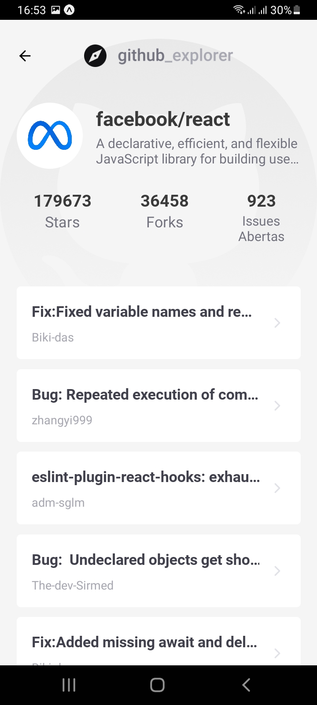
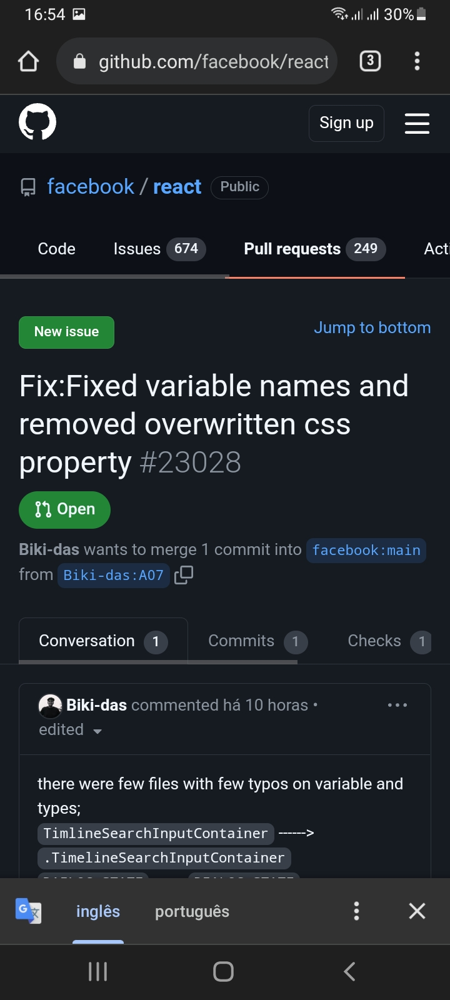

<h1 align="center">
    
</h1>

 

<h1 align="center">
  
  
  
   
</h1>

## 💻 Projeto

Aplicação proposta como desafio do Chapter III no Ignite (Curso realizado pela [Rocketseat](https://rocketseat.com.br/)) na trilha de React Native. 
A aplicação exibe informações sobre repositórios do GitHub. 
Este módulo teve como abordagem o consumo de apis e animações.  

## 💬 Funcionalidades
- Pesquisar um repositório, passando o nome do usuario seguido com nome do repositório, exemplo "facebook/react";
- Deletar um item pesquisado: arrastando da direita para a esquerda irá aparecer o botão de deletar;
- Exibir informações do repositório;
- Abrir o repositório direto no github.  

## 🚀 Tecnologias ultilizadas

- Este app foi criado com Bare Workflow, o qual possibilita criar aplicações **[React Native](https://reactnative.dev/)**, utilizando tanto as funcionalidades nativas do React Native como também as do **[Expo](https://docs.expo.io)**.

